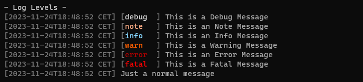

# Logger

Super customizable golang logger, including color support for all common operating systems (windows, linux, mac).

```go
package main

import (
	"gitlab.com/milan44/logger-v2"
)

func main() {
    // Default Logger
    log := logger_v2.New()

    // Custom output
    log.WithOutput(os.Stdout)

    // Options
    log.WithOptions(logger_v2.Options{
        NoColor: false,
        NoLevel: false,
        NoTime:  false,
    })

    log.Debug("This is a Debug Message")
    log.Note("This is an Note Message")
    log.Info("This is an Info Message")
    log.Warning("This is a Warning Message")
    log.Error("This is an Error Message")
    log.Fatal("This is a Fatal Message")

    // Gin Middleware
    // r := gin.Default()
    r.Use(log.Middleware())
}
```

