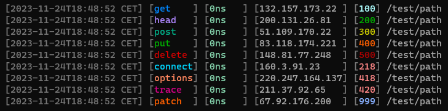

# Logger

Simple easy to use logger for golang. Supports colors and different log levels.

```go
package main

import (
	"github.com/coalaura/logger"
)

func main() {
    // Default Logger
    log := logger.New()

    // Custom output
    log.WithOutput(os.Stdout)

    // Options
    log.WithOptions(logger.Options{
        NoColor: false,
        NoLevel: false,
        NoTime:  false,
    })

    log.Debug("This is a Debug Message")
    log.Note("This is an Note Message")
    log.Info("This is an Info Message")
    log.Warning("This is a Warning Message")
    log.Error("This is an Error Message")
    log.Fatal("This is a Fatal Message")
}
```


## HTTP Middleware

The logger supplies a `LogHTTPRequest(MiddlewareAdapter)` function. There are also adapters available for various http frameworks like fiber, gin and more.

```go
package main

import (
    "github.com/coalaura/logger"
    adapter "github.com/coalaura/logger/fiber"
    "github.com/gofiber/fiber/v2"

    // adapter "github.com/coalaura/logger/fiber"
    // adapter "github.com/coalaura/logger/gin"
    // adapter "github.com/coalaura/logger/echo"
    // adapter "github.com/coalaura/logger/http"
)

var log = logger.New()

func main() {
    app := fiber.New()

    app.Use(adapter.FiberMiddleware(log))

    // ...
}
```

